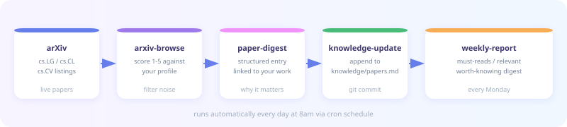
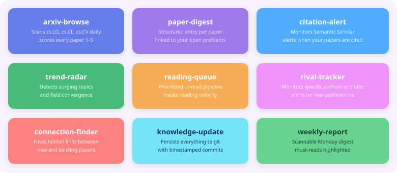
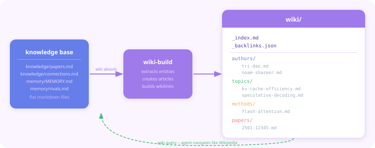
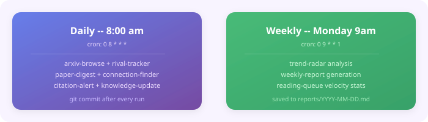

<p align="center">
  
</p>

<p align="center">
  
  
  
  
  
</p>

<p align="center">
  
</p>

---

paper-tracker is a git-native AI agent that lives inside your repository. Every day it browses arXiv, reads abstracts, scores papers against your research profile, tracks who cites your work, monitors rival labs, detects field trends, and manages your reading queue. Everything it learns is committed to git. Your entire research history is version-controlled.

---

## How it works

<p align="center">
  
</p>

The agent runs on a cron schedule. Each day it fetches live arXiv listings, scores every paper against your profile in `memory/MEMORY.md`, writes structured digest entries that connect each paper to your specific open problems, finds hidden connections between new and existing papers, checks Semantic Scholar for new citations of your own work, and commits everything to git with a timestamped message.

---

## Skills

<p align="center">
  
</p>

| Skill | What it does |
|---|---|
| `arxiv-browse` | Scans cs.LG, cs.CL, cs.CV daily. Scores every paper 1-5 against your profile. Skips already-seen papers. |
| `paper-digest` | Fetches each relevant paper's abstract page. Writes a structured entry connecting it to your specific open problems. |
| `citation-alert` | Queries Semantic Scholar for new citations of your own papers. Alerts you the moment someone cites your work. |
| `trend-radar` | Analyzes the last 30 days of tracked papers. Detects surging topics, field convergence, and new entrants to your area. |
| `reading-queue` | Manages a prioritized unread pipeline. Tracks reading velocity. Recommends what to read next based on your current focus. |
| `rival-tracker` | Monitors specific authors and labs on arXiv. Alerts the moment they publish new work. |
| `connection-finder` | Finds non-obvious links between new papers and your existing knowledge base. Flags contradictions and direct extensions. |
| `knowledge-update` | Appends all new papers to `knowledge/papers.md` and commits to git with a timestamped message. |
| `wiki-build` | Builds a personal research Wikipedia from tracked papers. Creates interlinked author, topic, method, and paper articles with `[[wikilinks]]` and a backlink index. |

---

## Research Wiki (Farzapedia-style)

<p align="center">
  
</p>

paper-tracker builds a personal research Wikipedia from everything it tracks. Inspired by the Farzapedia concept -- a personal knowledge base structured for agents to navigate, not humans to browse.

Every paper absorbed becomes interlinked articles: one for each author, one for each topic, one for each method. The agent navigates this wiki like Wikipedia -- following `[[wikilinks]]` from topic to author to paper -- to answer questions from your accumulated knowledge rather than a web search.

**Build the wiki from your tracked papers:**

```bash
node demo.js "wiki absorb"
```

**Query your research knowledge:**

```bash
node demo.js "wiki query: what do I know about speculative decoding and who are the key authors?"
node demo.js "wiki query: which methods address my KV cache open problem?"
node demo.js "wiki query: what have rival labs published on attention efficiency?"
node demo.js "wiki status"
```

**Wiki structure:**

```
wiki/
  _index.md              # master index with aliases
  _backlinks.json        # reverse link index
  authors/               # one article per tracked author
  topics/                # research topic articles
  methods/               # technique and method articles
  papers/                # full articles for score-5 papers
  connections/           # cross-cutting insight articles
  rivals/                # lab and group articles
```

The wiki is committed to git after every absorb. `git log wiki/` shows the history of your understanding growing over time. Fork the repo to share your research knowledge base with your lab.

---

## Schedules

<p align="center">
  
</p>

---

## File structure

```
paper-tracker/
├── agent.yaml                    # gitagent manifest
├── SOUL.md                       # agent identity and values
├── RULES.md                      # hard behavioral constraints
├── demo.js                       # run the agent directly
├── assets/                       # SVG diagrams and logo
├── memory/
│   ├── MEMORY.md                 # your research profile (edit this)
│   ├── rivals.md                 # authors and labs to monitor (edit this)
│   ├── seen-papers.md            # deduplication log
│   ├── citation-log.md           # citation alert history
│   └── rival-log.md              # rival publication history
├── knowledge/
│   ├── papers.md                 # growing knowledge base
│   └── connections.md            # discovered paper connections
├── queue/
│   ├── unread.md                 # prioritized reading queue
│   ├── reading.md                # currently reading
│   ├── read.md                   # completed with your takeaways
│   └── skipped.md                # consciously skipped
├── reports/                      # weekly digest reports
├── schedules/
│   ├── daily-arxiv-scan.yaml     # runs every day at 8am
│   └── weekly-digest.yaml        # runs every Monday at 9am
├── skills/
│   ├── arxiv-browse/SKILL.md
│   ├── paper-digest/SKILL.md
│   ├── citation-alert/SKILL.md
│   ├── trend-radar/SKILL.md
│   ├── reading-queue/SKILL.md
│   ├── rival-tracker/SKILL.md
│   ├── connection-finder/SKILL.md
│   ├── knowledge-update/SKILL.md
│   └── weekly-report/SKILL.md
└── tools/
    ├── fetch-page.yaml
    └── download-pdf.yaml
```

---

## Setup

**1. Install gitclaw**

```bash
npm install -g gitclaw
```

**2. Edit your research profile**

Open `memory/MEMORY.md` and fill in your research areas, keywords, current open problems, and your own papers for citation tracking.

**3. Add rivals to monitor**

Open `memory/rivals.md` and add the authors or labs you want to track.

**4. Run it now**

```bash
export ANTHROPIC_API_KEY="sk-ant-..."
node demo.js "Run the full daily paper tracking pipeline"
```

**5. Start the scheduler**

```bash
gitclaw schedule start
```

The agent now runs every day at 8am and every Monday at 9am automatically.

---

## On-demand commands

Talk to the agent directly at any time:

```bash
node demo.js "What should I read next?"
node demo.js "Mark 2501.12345 as read"
node demo.js "Show my reading stats"
node demo.js "Find connections for the last 3 papers added"
node demo.js "Run the rival-tracker skill"
node demo.js "Generate this week's trend report"
```

---

## The git angle

Every paper added, every citation found, every rival publication detected is a git commit. Your research history is permanently version-controlled.

```bash
git log --oneline              # every day's harvest
git diff HEAD~7                # what was added this week
git log --grep="score:5"       # all must-read papers ever found
git log --grep="RIVAL ALERT"   # every rival publication ever tracked
git log --grep="NEW CITATION"  # every time someone cited your work
```

Fork this repo to share your knowledge base with your lab. Branch it for a new research direction. Tag it at submission deadlines.

---

## Validation

```bash
npx @open-gitagent/gitagent validate
npx @open-gitagent/gitagent info
```

---

## Built with

- [gitagent](https://github.com/open-gitagent/gitagent) -- git-native agent standard
- [gitclaw](https://github.com/open-gitagent/gitclaw) -- agent runtime and SDK
- [arXiv](https://arxiv.org) -- paper source
- [Semantic Scholar API](https://api.semanticscholar.org) -- citation data

---

## License

MIT
